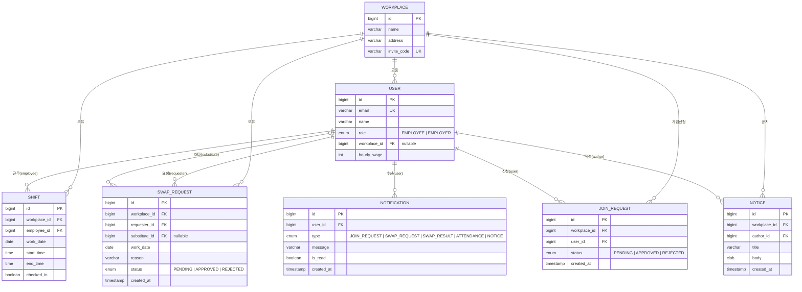

# PTManager ERD

`com.ptmanager.backend.domain` JPA 엔티티 기준 데이터 ERD.
영속화는 Spring Data JPA + H2(임베디드, `MODE=PostgreSQL`)로 구현되어 있으며, 엔티티는 DB 비종속이라 PostgreSQL로 교체 가능하다. 엔티티 간 관계는 JPA 연관관계 대신 **plain `Long` 외래키 컬럼**으로 표현한다(평면 JSON 직렬화 목적).

## ER 다이어그램 (Mermaid)



## 관계 요약

| 관계 | 종류 | 설명 |
|------|------|------|
| Workplace → User | 1 : N | 매장 소속 직원/사장 |
| Workplace → Shift / SwapRequest / JoinRequest / Notice | 1 : N | 매장이 소유하는 레코드 |
| User(employee) → Shift | 1 : N | 직원이 수행하는 근무 |
| User(requester) → SwapRequest | 1 : N | 대타 요청자 |
| User(substitute) → SwapRequest | 0..1 : N | 대타 지정 직원(nullable) |
| User(user) → JoinRequest | 1 : N | 가입 신청자 |
| User(author) → Notice | 1 : N | 공지 작성자 |
| User(user) → Notification | 1 : N | 알림 수신자 |

## SQL DDL (PostgreSQL 예시)

```sql
CREATE TABLE workplace (
    id          BIGINT PRIMARY KEY GENERATED ALWAYS AS IDENTITY,
    name        VARCHAR(255) NOT NULL,
    address     VARCHAR(255),
    invite_code VARCHAR(16)  NOT NULL UNIQUE
);

CREATE TABLE app_user (
    id           BIGINT PRIMARY KEY GENERATED ALWAYS AS IDENTITY,
    email        VARCHAR(255) NOT NULL UNIQUE,
    name         VARCHAR(255) NOT NULL,
    role         VARCHAR(16)  NOT NULL CHECK (role IN ('EMPLOYEE', 'EMPLOYER')),
    workplace_id BIGINT       REFERENCES workplace(id),
    hourly_wage  INTEGER      NOT NULL DEFAULT 0
);

CREATE TABLE shift (
    id           BIGINT PRIMARY KEY GENERATED ALWAYS AS IDENTITY,
    workplace_id BIGINT  NOT NULL REFERENCES workplace(id),
    employee_id  BIGINT  NOT NULL REFERENCES app_user(id),
    work_date    DATE    NOT NULL,
    start_time   TIME    NOT NULL,
    end_time     TIME    NOT NULL,
    checked_in   BOOLEAN NOT NULL DEFAULT FALSE
);

CREATE TABLE swap_request (
    id            BIGINT PRIMARY KEY GENERATED ALWAYS AS IDENTITY,
    workplace_id  BIGINT      NOT NULL REFERENCES workplace(id),
    requester_id  BIGINT      NOT NULL REFERENCES app_user(id),
    substitute_id BIGINT          NULL REFERENCES app_user(id),
    work_date     DATE        NOT NULL,
    reason        VARCHAR(500) NOT NULL,
    status        VARCHAR(16) NOT NULL DEFAULT 'PENDING'
                  CHECK (status IN ('PENDING', 'APPROVED', 'REJECTED')),
    created_at    TIMESTAMPTZ NOT NULL DEFAULT now()
);

CREATE TABLE join_request (
    id           BIGINT PRIMARY KEY GENERATED ALWAYS AS IDENTITY,
    workplace_id BIGINT      NOT NULL REFERENCES workplace(id),
    user_id      BIGINT      NOT NULL REFERENCES app_user(id),
    status       VARCHAR(16) NOT NULL DEFAULT 'PENDING'
                 CHECK (status IN ('PENDING', 'APPROVED', 'REJECTED')),
    created_at   TIMESTAMPTZ NOT NULL DEFAULT now()
);

CREATE TABLE notice (
    id           BIGINT PRIMARY KEY GENERATED ALWAYS AS IDENTITY,
    workplace_id BIGINT      NOT NULL REFERENCES workplace(id),
    author_id    BIGINT      NOT NULL REFERENCES app_user(id),
    title        VARCHAR(255) NOT NULL,
    body         TEXT        NOT NULL,
    created_at   TIMESTAMPTZ NOT NULL DEFAULT now()
);

CREATE TABLE notification (
    id         BIGINT PRIMARY KEY GENERATED ALWAYS AS IDENTITY,
    user_id    BIGINT      NOT NULL REFERENCES app_user(id),
    type       VARCHAR(24) NOT NULL,
    message    VARCHAR(255) NOT NULL,
    is_read    BOOLEAN     NOT NULL DEFAULT FALSE,
    created_at TIMESTAMPTZ NOT NULL DEFAULT now()
);
```

> `user`는 다수 DB에서 예약어이므로 테이블명을 `app_user`로 사용했다(엔티티 `@Table(name="app_user")`).
